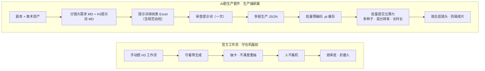

<div align="center">

# AI剧生产套件 · AI Drama Production Suite

**面向 MiniMax H3 创作者的一站式漫剧生产工具**
**A one-stop production suite for MiniMax H3 drama creators**

</div>

<div align="center">

#### 🎬 演示视频 / Demo Video

[▶ 点击观看套件演示视频 · Watch the Suite Demo](https://www.bilibili.com/video/BV1MMuR6fEnf/?share_source=copy_web&vd_source=ac000c263d73c325e7ba5b3e3d2830d7)

</div>

---

## 为什么做这套工具 / Why This Suite

**先夸一夸 H3。** MiniMax H3 是当前漫剧 / 短剧生成里第一梯队的模型：给它一张参考图、一段提示词，它就能把角色、场景、对白、环境声串成一条连贯的成片镜头，质量让人眼前一亮。

**但用官方工作流做一整部漫剧，是一场折磨。** 因为 H3 官流要求你：

- **守在机器前**：一镜一镜地喂提示词、等采样、看结果，人不能走开；
- **抽卡式生成**：同样的提示词，换一个种子结果就天差地别，不满意就得反复重抽；
- **重复烧钱**：每改一版，都要把提示词重新推过 32B 文本编码器，昂贵且浪费；
- **人不离机**：一个人被钉在工作流前面，效率低，身心俱疲。

**现实拍片不是这么干的。** 剧组会一次性拍出一大堆镜头素材，再进剪辑台，挑合适的、拼成片。漫剧生产本该如此：**先生成一堆候选镜头，再挑选、剪辑**，而不是一镜一镜守着机器熬。

**为了把"生产"从"创作"里剥离出来，我们做了这套工具。** 你只需要提供**剧本**和**美术资产**，剩下的交给工具链：审查一次提示词后全自动，最贵的条件编码固化为 `.pt` 缓存、全程只跑一次，`.pt` 还能**批量提交给云算力**跑复数种子 / 高分辨率 / 长时长，一次产出一大批候选镜头；你回到剪辑台挑合适的，把省下的时间拿去**打磨剧本和美术**。

> **一句话**：H3 负责"拍"，这套工具负责"让拍片不折磨人"——生产端剥离，创作端归你。
>
> **TL;DR**: H3 does the "shooting"; this suite makes shooting not soul-crushing — production is decoupled, creation stays with you.

### 官方工作流 vs 本套件



| 维度 | 官方工作流 | 本套件 |
| --- | --- | --- |
| 人在不在机前 | 必须守着，人不离机 | 审查一次提示词后全自动 |
| 生成方式 | 单镜抽卡，反复重抽 | 批量预编码 `.pt`，一次成批 |
| 条件编码 | 每版重跑 32B 编码 | 固化 `.pt` 缓存，全程只跑一次 |
| 算力 | 只能本地单机 | 可批量提交云算力，多种子 / 高分辨率 / 长时长 |
| 创作者的时间 | 耗在等生成上 | 拿去打磨剧本与美术资产 |

> 这套工具把"从分镜头需求到成片"的整条漫剧生产链路串起来：分镜头需求 MD → 提示词审阅表 Excel → 多链生产 JSON → 批量预编码 `.pt` 缓存 → 批量生成视频。其中，最昂贵的文本/参考条件编码被固化为 `.pt` 缓存，全程只跑一次。
>
> This suite chains the whole comic-drama production path from shot requirements to finished video: shot-requirement MD → prompt-review Excel → multi-chain production JSON → batch pre-encode `.pt` cache → batch video generation. The most expensive text/reference conditioning encoding is persisted as `.pt` caches and runs only once.

---

## Table of Contents

- [为什么做这套工具 / Why This Suite](#为什么做这套工具--why-this-suite)
- [分镜导演 Skill / Storyboard Director Skill](#分镜导演-skill--storyboard-director-skill)
- [核心技术思路 / Core Idea](#核心技术思路--core-idea)
- [两阶段管线 / Two-Phase Pipeline](#两阶段管线--two-phase-pipeline)
- [安装 / Installation](#安装--installation)
- [节点文档 / Node Reference](#节点文档--node-reference)
- [示范工作流 1：多链预编码 / Demo 1: Multi-Chain Pre-Encode](#示范工作流-1多链预编码--demo-1-multi-chain-pre-encode)
- [示范工作流 2：批量生成 / Demo 2: Batch Generation](#示范工作流-2批量生成--demo-2-batch-generation)
- [示范工作流 3：单 pt 抽卡 / Demo 3: Single-Shot Gacha](#示范工作流-3单-pt-抽卡--demo-3-single-shot-gacha)
- [分镜头需求制作指南 / Shot Requirements Guide](#分镜头需求制作指南--shot-requirements-guide)
- [硬件要求 / Hardware Requirements](#硬件要求--hardware-requirements)
- [模型清单 / Models](#模型清单--models)
- [许可 / License](#许可--license)

---

## 分镜导演 Skill / Storyboard Director Skill

> 本仓库附带两个 Skill，负责生产链路的第一环：
> - **分镜导演**（`skills/storyboard-director/`）：把**任意剧本 / 场景描述**转成合格的分镜头需求 MD（含镜头调度、美术资产需求），供下游工具链消费。
> - **H3 提示词编写**（`skills/h3-prompt-writer/`）：把分镜头需求逐镜转成 **H3 提示词 MD**（`## A01` 九分节格式），供提示词审阅与规范自检消费。

### Skill 是什么 / What the Skill Does

一个面向 **AI 动画短剧生产** 的分镜设计与审阅知识库 + 标准流程。它把专业分镜方法论沉淀为可调用的规范，帮助 AI 从剧本出发，设计出既符合叙事规律、又满足 H3 生成可行性的结构化分镜表与视频提示词。该 Skill 沉淀自真实 AI 动画短剧生产实践，公开版已去除未发布作品的敏感设定信息，保留可直接复用的完整方法论。

### 目录结构 / Structure

```
skills/storyboard-director/
├── SKILL.md                  # 主规范：触发条件、流程、H3 提示词规则、输出模板
└── references/               # 分镜知识库（7 个子库）
    ├── 01_分镜理论库/          # 景别、机位、构图、节奏、转场、运镜
    ├── 02_方法论库/            # 剧本拆解、情绪镜头、镜头序列设计、衔接逻辑
    ├── 03_评审标准库/          # 分镜评审 Checklist、AI 动画特殊检查项
    ├── 04_项目规范/            # 风格规范、标准分镜表模板、短剧铁律、镜头语言速查
    ├── 05_参考案例/            # 横屏 / 竖屏分镜示例（文学版转结构化版）
    ├── 06_H3提示词指南/        # H3 base / reference 提示词规范
    └── 07_官方分镜方法论/       # H3 官方工作流与分镜表设计
```

### 使用方法 / Usage

**在 TRAE 中使用（推荐）**：把 `skills/storyboard-director/` 复制到任一项目的 `.trae/skills/` 下，重启后即可作为 Skill 调用。向 AI 提出任意一种诉求即可触发：

| 触发诉求 | 示例 | 输出 |
| --- | --- | --- |
| 设计分镜 | "帮我设计第X集分镜" / "把这个剧本变成分镜" | 结构化分镜表 |
| 审阅分镜 | "帮我看看这个分镜合不合格" | 审阅报告 + Checklist |
| 优化分镜 | "这个分镜有问题，帮我改" | 修改后的分镜表 |
| 查询理论 | "什么是 180 度规则" / "推镜头和拉镜头的区别" | 理论库查询结果 |

**在其他 AI 工具中使用**：`SKILL.md` 本身是一份自洽的提示词规范，可整份粘贴给任意支持长上下文的 AI 助手，配合 `references/` 知识库使用。

### 与下游工具链的衔接 / Integration

Skill 输出的 **分镜头需求_第X集.md** 直接接入套件工具链（H3 提示词由 `h3-prompt-writer` Skill 另行生成）：

```
剧本 → 分镜导演 Skill → 分镜头需求_第X集.md
       → h3-prompt-writer Skill → H3提示词_第X集.md（## A01 九分节）
       → shot_md_to_excel.py → 提示词审阅表.xlsx（人工审阅 + 规范自检）
       → excel_to_multi_chain_json.py → 多链生产 JSON
       → 批量预编码 .pt → 批量生成视频
```

详见 [分镜头需求制作指南](docs/分镜头需求制作指南.md)。

---
## 为什么需要条件缓存 / Why Conditioning Cache

MiniMax H3 的文生视频/参考生视频在**每次采样前**都要把文本提示词推过 Qwen3-VL-32B 文本编码器，并把参考图和参考视频编码进 `minimax_refs` 潜空间。这一过程：

- 极其昂贵：32B 文本编码器是显存大头，几 GB 到几十 GB 的显存开销，且每次都要重新跑。
- 高度重复：同一镜头、同一批参考资源，只要提示词和参考图不变，编码结果就完全一致。

MiniMax H3 参考生视频在**每个采样步**都会把 `minimax_refs`（参考图像/视频潜空间）重新注入模型。因此，即便跳过文本编码，只要还想用参考图控制构图，就必须把参考潜空间也保留下来。

插件把整条 `CONDITIONING` 结构（含 NestedTensor 形式的 `minimax_refs`）固化到 `.pt` 文件；生成阶段直接读回，跳过全部重复编码。

For MiniMax H3, the text prompt must be pushed through the Qwen3-VL-32B text encoder and the reference images/videos encoded into `minimax_refs` latent before every sampling run. This is:

- Expensive: the 32B encoder dominates VRAM, and it re-runs every time.
- Repetitive: for the same shot with the same prompt and references, the encoding is bit-identical.

Because H3 re-injects `minimax_refs` at every sampling step, you must keep the reference latents even if you skip the text encoder. This plugin serializes the entire `CONDITIONING` structure (including the NestedTensor reference latents) to a `.pt` file; the generate phase reads it back and skips all repeat encoding.

---

## 核心技术思路 / Core Idea

### 1. 序列化完整条件结构 / Serialize the Full Conditioning

ComfyUI 自带的 LTX 条件保存/加载节点只持久化 `conditioning_data_*` 和 `attention_mask_*`，会**静默丢弃** `minimax_refs` —— 而 H3 恰恰要靠它来控制参考构图。

The stock LTXV conditioning saver/loader persists only `conditioning_data_*` and `attention_mask_*`, silently dropping `minimax_refs` — exactly the reference latents H3 needs.

本套件用递归转换器把 `conditioning` 里的 NestedTensor、张量、字典、列表全部降级为可被 `torch.save` 稳定 pickled 的普通结构，写盘时自带元数据（时长、宽高、帧率、帧数）。

This plugin recursively lowers every NestedTensor, tensor, dict and list inside the conditioning into a plain structure that `torch.save` can pickled deterministically, and writes metadata (duration, dimensions, FPS, frame count) alongside.

### 2. 两阶段解耦 / Two-Phase Decoupling

```
阶段一 预编码 (Pre-encode)            阶段二 生成 (Generate)
 Qwen3-VL-32B + 参考VAE编码            UNet + LoRA + 采样 + 双VAE解码
          │                                    ▲
          ▼                                    │ 读回缓存
   H3SaveConditioning ──► .pt 文件 ──► H3LoadConditioning(List)
   (昂贵，跑一次)                      (便宜，可反复、可批量)
```

### 3. 单链循环批量 / One-Chain Batch Loop

阶段二用自定义 for-loop 节点，把"取条件 → 采样 → 解码 → 存盘 → 清显存"包成**一条**链，由 ComfyUI 的 `GraphBuilder` 在运行时逐轮展开。模型 / VAE / LoRA 加载器放在循环体外，全程共享，避免 N 条平行链重复占用显存。

Phase two wraps "get conditioning → sample → decode → save → free memory" into a **single** chain that the for-loop nodes expand once per iteration via ComfyUI's `GraphBuilder`. Model/VAE/LoRA loaders stay outside the loop and are shared.

### 4. 断点续跑 / Resume-Friendly

保存节点检测到同名 `.pt` 已存在时直接跳过，配合每镜头独立文件，崩溃或显存溢出后无需重跑已完成镜头。

The save node skips when a same-named `.pt` already exists; combined with one file per shot, a crash or OOM never forces re-running finished shots.

---

## 两阶段管线 / Two-Phase Pipeline

| 阶段 | 做什么 | 负担 | 频率 |
| --- | --- | --- | --- |
| **预编码 Pre-encode** | 跑 Qwen3-VL-32B + 参考 VAE，把结果存 `.pt` | 重（显存大头） | 每镜头一次，可离线 |
| **生成 Generate** | 读 `.pt`，采样 + 双 VAE 解码，批量产出 | 轻 | 任意多次 |

好处：一部剧几百个镜头，预编码只做一遍；导演调整采样参数、换清显存策略、重出某几镜时，都不再碰 32B 编码器。

Benefits: for an episode with hundreds of shots, pre-encode runs exactly once; when you tweak sampling, change memory policy, or re-render specific shots, the 32B encoder is never touched again.

---

## 安装 / Installation

### 前置：安装 MiniMax H3 核心节点

本套件不含模型权重，也不含 H3 核心节点。先生成/安装 H3 官方整合包：

Prerequisite: install the MiniMax H3 core nodes (this plugin ships no weights and no H3 core nodes):

```bash
git clone https://github.com/MiniMax-AI/MiniMax-H3-ComfyUI \
  ComfyUI/custom_nodes/MiniMax-H3-ComfyUI
```

### 安装本套件 / Install this suite

```bash
git clone https://github.com/<your-org>/ComfyUI-H3-Conditioning-Cache-AI-Drama-Production-Suite \
  ComfyUI/custom_nodes/ComfyUI-H3-Conditioning-Cache-AI-Drama-Production-Suite
```

或手动把仓库根目录放入 `ComfyUI/custom_nodes/`。重启 ComfyUI 后，节点会出现在 `H3Cache` 和 `H3Cache/循环` 分类下。

Or drop the repo root into `ComfyUI/custom_nodes/` manually. After restart, nodes appear under the `H3Cache` and `H3Cache/循环` categories.

### 依赖 / Dependencies

无额外 Python 依赖。所有 import（`torch`、`folder_paths`、`comfy.*`、`comfy_execution`）均来自 ComfyUI 运行时。请按 `models.md` 准备模型文件。

No extra Python dependencies. Everything imported comes from the ComfyUI runtime. Prepare model files per `models.md`.

---

## 节点文档 / Node Reference

### H3Cache 分类 / Category

| 节点 | 输入 | 输出 | 说明 |
| --- | --- | --- | --- |
| `H3SaveConditioning` | `conditioning`, `filename`; 可选 `duration`/`width`/`height` | — | 序列化完整条件到 `.pt`，带元数据；已存在则跳过 |
| `H3LoadConditioning` | 下拉选 `.pt`; 可选 `cache_dir` | `CONDITIONING` | 读回单镜条件并搬到计算设备 |
| `H3LoadConditioningBatch` | `shots`(逗号分隔); 可选 `cache_dir` | 最多 24 路 `CONDITIONING` | 一次加载一批，批量出图 |
| `H3FreeMemory` | `trigger`(任意); 可选 `mode` | — | 镜头结束后清 GPU+CPU，防长跑 OOM |
| `H3SaveVideo` | `video`, `save_path` | `saved_path` | 无预览存盘，适配循环体 |

### H3Cache/循环 分类（公开节点）/ Category (public)

| 节点 | 说明 |
| --- | --- |
| `H3ForLoopStart` | 循环开始，输出 `循环控制` 与 `当前序号` |
| `H3ForLoopEnd` | 循环结束，回传值并决定是否展开下一轮 |
| `H3LoadConditioningList` | 解析 `.pt` 文件**路径**为列表（不加载张量，VRAM 安全） |
| `H3ConditioningIndex` | 按 `index` **懒加载**单个 `.pt` 为 conditioning（每轮只加载一个） |
| `H3ShotNameByIndex` | 按 `index` 取当前镜头名，拼保存路径 |
| `H3ReadConditioningMeta` | 读 `.pt` 元数据（时长/宽高/帧数），支持混合时长 |

> 公开 for-loop 依赖 ComfyUI 的 `GraphBuilder`（现代版本均内置）。`H3ForLoopWhile*`、`H3ForLoopIntAdd`、`H3ForLoopIntLess` 为内部展开节点，通常无需手动放置。

The public for-loop nodes rely on ComfyUI's `GraphBuilder` (built into recent versions). `H3ForLoopWhile*`, `H3ForLoopIntAdd`, `H3ForLoopIntLess` are internal expansion nodes; you usually do not place them manually.

### 缓存目录解析 / Cache Path Resolution

`H3LoadConditioning` / `H3LoadConditioningList` / `H3ReadConditioningMeta` 支持 `cache_dir` 自定义绝对路径；留空时按以下顺序自动搜索：

These loaders accept a custom absolute `cache_dir`; when empty they search in order:

1. `cache_dir` + 文件名
2. 文件名（若为绝对路径）
3. `output/` 根目录
4. `output/h3_cond_cache/`
5. ComfyUI `input/` 目录

---

## 示范工作流 1：多链预编码 / Demo 1: Multi-Chain Pre-Encode

> `example_workflows/preencode_multi_chain_黑猫.json`

**目标**：一个角色（黑猫）属下全部镜头，一次跑完预编码。通过**共享** CLIP / Video VAE / Audio VAE / 分辨率设置压显存——32B 文本编码器只在内存里放一份。

**Goal**: pre-encode every shot under one character (a black cat) in a single run, sharing CLIP / Video VAE / Audio VAE / resolution to keep the 32B encoder loaded only once.

结构（8 镜：B20, B23, B30, D01, D02, D03, D27, D28）：

```
CLIPLoader (Qwen3VL 32B) ──────────────┐
VAELoader (Video VAE) ─────────────────┤
VAELoader (Audio VAE) ─────────────────┤ 共享到每一镜
ResolutionSelector (16:9) ─────────────┘
                                         每个镜头并列：
easy promptLine ──► MiniMaxH3ReferenceToVideo ──► H3SaveConditioning
                       │  (ref_image_0=角色, ref_image_1=场景)
```

- 每镜用 `easy promptLine` 提供 H3 提示词（含 `overall_soundscape`、`non_diegetic_music`）。
- 每镜 `MiniMaxH3ReferenceToVideo` 的 `ref_image_0` 接角色定妆照、`ref_image_1` 接该镜场景参考图。
- `H3SaveConditioning` 的 `filename` 即镜头名（如 `B20`），并把 `duration` 一并写入元数据。
- 生成产物为 `output/h3_cond_cache/B20.pt` 等。

> 参考图路径指向私有美术资产，**未随仓库提交**。运行前请替换为你的角色/场景参考图。`.pt` 一旦写出即与图像无关，生成阶段不再需要这些图。

> The reference image paths point to private artistic assets and are **not** committed. Replace them with your own before running. Once a `.pt` is written it becomes image-independent; the generate phase no longer needs the images.

---

## 示范工作流 2：批量生成 / Demo 2: Batch Generation

> `example_workflows/generate_batch_forloop_175shots.json`

**目标**：读回一整串 `.pt`，用一条循环链灌进生成管线，一次跑完 175 镜并逐镜存盘。

**Goal**: load a whole list of `.pt`, feed a single for-loop chain into the generation pipeline, and render all 175 shots in one run, saving each shot.

结构：

```
模型加载（循环体外，共享）：
 UNETLoader (H3 ref2va int8) ─► LoraLoaderModelOnly (Turbo LoRA)
 VAELoader (Video VAE) / VAELoader (Audio VAE)
 KSamplerSelect (res_multistep) / BasicScheduler (6步 simple) / RandomNoise

循环体（每条链逐轮展开）：
 H3LoadConditioningList(shots) ──► paths列表 ──► H3ForLoopStart(total=count) ──► index
      │  └─► H3ConditioningIndex(paths,index) ──► 懒加载单个.pt ──► BasicGuider ──► SamplerCustomAdvanced
      └─► H3ShotNameByIndex(shot_names,index) ──► H3SaveVideo.save_path
      └─► H3ReadConditioningMeta(shot_names,index)
              └─► EmptyMiniMaxH3LatentAV(width,height,frame_count)  ※ 元数据驱动
 SamplerCustomAdvanced ─► VAEDecode(Video) ─► VAEDecodeAudio(Audio) ─► CreateVideo
      └─► H3SaveVideo ─► H3ForLoopEnd
```

- **懒加载（VRAM 安全）**：`H3LoadConditioningList` 只解析文件路径，不加载张量；`H3ConditioningIndex` 每轮只加载当前索引对应的单个 `.pt` 到 GPU，用完即释放。400+ 镜头批量也不会爆显存。
- **元数据驱动**：`H3ReadConditioningMeta` 把每镜的时长/宽高/帧数读给 `EmptyMiniMaxH3LatentAV`，因此同一循环可混排不同时长镜头，无需按时长分组。
- **按镜头名存盘**：`H3ShotNameByIndex` 拼出 `h3_videos/<镜头名>`，`H3SaveVideo` 存为无预览的 MP4。
- 模型与 VAE 加载器在循环外，只加载一次；循环体内是"取 → 采样 → 解码 → 存 → 清"的单链。

- **Metadata-driven**: `H3ReadConditioningMeta` feeds each shot's duration/width/height/frame count into `EmptyMiniMaxH3LatentAV`, so one loop can mix shots of different durations without grouping by duration.
- **Save by shot name**: `H3ShotNameByIndex` builds `h3_videos/<shot>` and `H3SaveVideo` writes a preview-less MP4.
- Model & VAE loaders sit outside the loop and load once; the body is a single "fetch → sample → decode → save → free" chain.

---

## 示范工作流 3：单 pt 抽卡 / Demo 3: Single-Shot Gacha

> `example_workflows/generate_single_gacha_A01.json`

**目标**：针对**单个**不满意镜头，加载它对应的单个 `.pt` 缓存，反复换种子抽卡，直到满意。适合导演在批量产出后挑选候选时，对个别镜头单独重抽。

**Goal**: load the single `.pt` cache of one unsatisfactory shot and re-sample it repeatedly with different seeds, until satisfied. Use this to re-draw individual shots after batch production.

结构（单镜，无循环）：

```
模型加载（共享）：
 UNETLoader (H3 ref2va int8) ─► LoraLoaderModelOnly (Turbo LoRA)
 VAELoader (Video VAE) / VAELoader (Audio VAE)
 KSamplerSelect (res_multistep) / BasicScheduler (6步 simple) / RandomNoise

单镜抽卡：
 H3LoadConditioning(file_name=A01.pt) ──► BasicGuider ──► SamplerCustomAdvanced
 EmptyMiniMaxH3LatentAV(width,height,length)  ※ 手动调参，可即时改分辨率/帧数
 RandomNoise ──► 换种子反复抽

SamplerCustomAdvanced ─► VAEDecode(Video) ─► VAEDecodeAudio(Audio) ─► CreateVideo
      └─► H3SaveVideo(save_path=h3_videos/A01_抽卡)
```

- **单镜加载**：用 `H3LoadConditioning` 直接拉取目标镜头（如 `A01.pt`），不再走批量列表。
- **手动调参**：`EmptyMiniMaxH3LatentAV` 由你手工填宽高/帧数，抽卡时改分辨率、帧数、时长即时生效，无需重跑 32B 编码。
- **换种子抽卡**：`RandomNoise` 设为 `randomize`，每次采样换一个种子；不满意只动这一镜，不碰其他镜头。
- **按镜头名存盘**：`H3SaveVideo` 存为 `h3_videos/A01_抽卡.mp4`，与批量产出的镜头区分开。

- **Single-shot load**: `H3LoadConditioning` pulls one target shot (e.g. `A01.pt`) directly, no batch list.
- **Manual tuning**: `EmptyMiniMaxH3LatentAV` is filled by hand; change resolution/frame count/duration on the fly without re-running the 32B encoder.
- **Re-draw by seed**: `RandomNoise` set to `randomize`; each run draws a new seed, touching only this shot.
- **Save by shot name**: `H3SaveVideo` writes `h3_videos/A01_抽卡.mp4`, distinct from batch output.

---

## 分镜头需求制作指南 / Shot Requirements Guide

本仓库的 `tools/` 目录提供一套从分镜头需求到 ComfyUI 生产 JSON 的工具链：

This repo's `tools/` directory provides a toolchain that converts shot requirement documents into ComfyUI production JSON:

```
分镜头需求_第X集.md  →  shot_md_to_excel.py  →  提示词审阅表.xlsx  →  excel_to_multi_chain_json.py  →  多链生产JSON
H3提示词_第X集.md    ↗                            （含规范自检）

> 生成的多链 JSON 中，**每个镜头拥有独立的分辨率选择器与时长节点**，支持整集不同镜头混用 0.4/0.5 分辨率与不同时长，无需按时长分组。
```

| 工具 | 功能 | 输入 | 输出 |
| --- | --- | --- | --- |
| `shot_md_to_excel.py` | 解析**三种格式**MD（分镜头需求 / v6 / H3提示词），自动检测格式，生成审阅表 Excel + 规范自检 | `.md` 文件 | `.xlsx`（Sheet1 审阅 + Sheet2 资产路径 + Sheet3 说明）+ 自检报告 |
| `excel_to_multi_chain_json.py` | 读取审阅后的 Excel，生成多链生产 JSON（每镜**独立**分辨率+时长节点） | `.xlsx` 文件 | ComfyUI workflow JSON（按角色分组或 `--by-shot` 按镜头分组） |
| `h3_tools_gui.py` | **推荐**：桌面 GUI 工具，三标签页（MD→Excel / 资产管理 / Excel→JSON），统一批量处理 | 多个文件 | 批量输出 |

**如何编写合格的分镜头需求 MD 文件？** 详见 [`docs/分镜头需求制作指南.md`](docs/分镜头需求制作指南.md)——包含完整的格式规范、H3 提示词编写规则、字段映射表、示例和 AI 助手快速参考。

**How to write a compliant shot requirements MD file?** See [`docs/分镜头需求制作指南.md`](docs/分镜头需求制作指南.md) for the complete format specification, H3 prompt writing rules, field mapping tables, examples, and an AI assistant quick reference.

### 快速上手 / Quick Start（GUI 优先）

**推荐流程**：启动桌面 GUI 工具，在三标签页间完成"MD→Excel → 资产管理 → Excel→JSON"全流程：

```bash
# 1. 启动 GUI
python tools/h3_tools_gui.py
```

1. **Tab 1（MD→Excel）**：选择分镜头需求 / H3提示词 MD 文件（自动检测格式），生成审阅表 `.xlsx`，并可一键执行**规范自检**。
2. **Tab 2（资产管理）**：上传/填写美术资产路径（角色/场景/道具），可保存为映射 JSON。
3. **Tab 3（Excel→JSON）**：读取审阅后的 Excel（结合资产映射），生成多链生产 JSON。

**审阅环节**（手动，在 Excel 中完成）：
- 审阅每镜提示词，必要时在"修改指令"列填写修改意见。
- 分辨率列下拉选择 `0.4`（经济）或 `0.5`（高清）；每镜可独立设置。
- 时长列直接编辑数值（支持 `11秒` 这类带单位写法，脚本自动解析）。
- 在 Sheet2 填写/核对各资产在 ComfyUI `input/` 目录下的相对路径。

### 规范自检 / Specification Self-Check

> 分镜头需求与 H3 提示词拆分为独立文件后，**规范自检**（`shot_md_to_excel.py` 的 `spec_check_h3_prompt`，GUI Tab 1 内置）在生成审阅表前先扫描 H3 提示词 MD，把不合规处直接标成**错误 / 警告**，避免带病提示词进入生产。

自检覆盖以下规则：

| 检查项 | 级别 | 说明 |
| --- | --- | --- |
| 缺失分节 | 错误 | 九分节（输出规格/参考图约束/整体风格/场景描述/两级时间轴/摄影与摄像机/光影/声音/约束条件）缺一即报 |
| 指代不明 | 错误 | 命中"人影 / 一个人 / 那个人 / 身影 / 剪影中的人"等无主指代，附上下文行 |
| 对白格式 | 错误 | `<d>` 台词缺语言标签（`[Chinese]` 等 6 类）或缺性别标签（`[男]/[女]/[群杂]`） |
| 画风锚点 | 警告 | 【整体风格】缺少画风锚点（如 `D4rkL1nes`） |
| 画风冲突 | 警告 | 【整体风格】出现"实拍 / 3D渲染 / photorealistic"等与 2D 赛璐璐冲突的词（"非/不/无"否定表述不计） |
| 非叙事音乐 | 警告 | 【声音】含"非叙事音乐"但未写"无背景音乐，禁止任何配乐/音乐" |
| 时长一致性 | 警告 | 【输出规格】时长与【两级时间轴】时长不一致 |
| 参考图槽位 | 警告 | 【参考图约束】未使用 `<图片N>` 槽位写法 |

自检报告在 GUI 中即时显示，可一键导出为 `.md` 存档；命令行下可用：

```bash
python -c "import sys; sys.path.insert(0,'tools'); import shot_md_to_excel as m; r,e,w=m.spec_check_h3_prompt('H3提示词_第1集.md'); print('\n'.join(r))"
```

---

### 命令行方式 / CLI Alternative

```bash
# 1. MD → Excel（自动检测格式；分镜头需求 / v6 / H3提示词 均可）
python tools/shot_md_to_excel.py 分镜头需求_第1集.md -o 提示词审阅表_第1集.xlsx
python tools/shot_md_to_excel.py H3提示词_第1集.md -o 提示词审阅表_第1集.xlsx

# 2. Excel → JSON（-m 加载资产映射补充路径；--by-shot 按镜头分组）
python tools/excel_to_multi_chain_json.py 提示词审阅表_第1集.xlsx -o output/json/ -m assets_mapping.json --by-shot

# 3. 将 JSON 导入 ComfyUI，运行预编码 → 生成视频
```

---

## 硬件要求 / Hardware Requirements

瓶颈在**预编码**阶段（32B 文本编码器），生成阶段轻得多。

The bottleneck is the **pre-encode** phase (the 32B text encoder); the generate phase is much lighter.

| 档位 | 预编码 | 生成 | 备注 |
| --- | --- | --- | --- |
| 推荐 | RTX 4090 24GB | 24GB | int8 编码器 ~25GB |
| 下限 | 8GB + 32GB 内存 | 8GB | 用 `nvfp4_awq` 量化（~14.6GB）+ ComfyUI CPU offload |

- 32B 文本编码器**架构上必需**，不能用小 Qwen 替代。
- 8GB 显存跑整条管线（含预编码）的可行性依据社区量化 + CPU offload 方案，需实机验证。

- The 32B text encoder is architecturally required; it cannot be swapped for a smaller Qwen.
- Running the full pipeline (including pre-encode) on 8 GB relies on community quantization + CPU offload and should be verified on real hardware.

---

## 模型清单 / Models

见 [`models.md`](models.md)：Qwen3-VL-32B H3 文本编码器、H3 ref2va UNet、Turbo LoRA、Video/Audio VAE 的放置目录与文件名。

See [`models.md`](models.md) for the Qwen3-VL-32B H3 text encoder, H3 ref2va UNet, Turbo LoRA and Video/Audio VAE subfolders and filenames.

---

## 许可 / License

[MIT](LICENSE). 本套件代码可自由使用；引用的 MiniMax H3 模型与整合包遵循其各自许可。

[MIT](LICENSE). The plugin code is freely usable; the referenced MiniMax H3 models and integration follow their own licenses.
